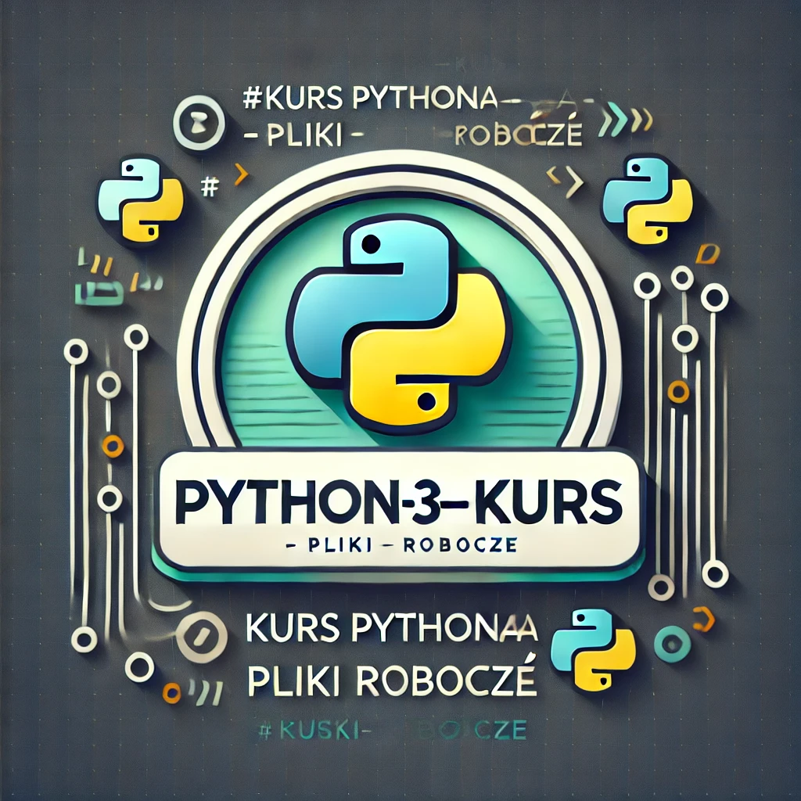

# Python-3---Kurs

## Kurs Pythona - Pliki Robocze

To repozytorium zawiera pliki robocze do mojego kursu Pythona. Znajdziesz tu różne materiały, przykłady kodu i ćwiczenia, które pomogą mi w nauce Pythona.

### Struktura repozytorium

Wszystkie pliki robocze znajdują się w katalogu głównym repozytorium.

